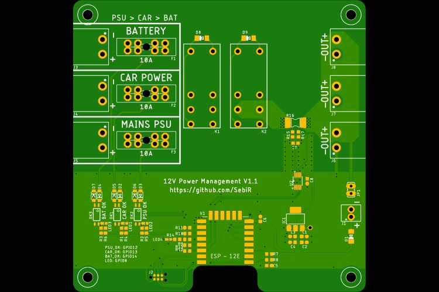

# 12V Power Management
A Tasmota compatible power selector for Caravans including automatic power source switching between on-board battery, car power and a mains PSU.
A INA226 measures the output voltage and current, the presence of the power sources are also available on GPIOs.

## Features
* Up to 15A (10A nom.)
* Fused inputs
* Current and voltage measurement
* Automatic source switching with priorities (hard-wired)

## Tasmota Configuration
Tasmota won't probe the INA226 unless full-scale current and the value of the shunt resistor are set.
 
`Sensor54 10 Return channel 1 shunt resistance and full scale current`

`Sensor54 11 [shunt_resistance] Set INA226 channel 1 shunt resistance in ohms, floating point`

`Sensor54 12 [full_scale_current] Set INA226 channel 1 full scale current in amperes, floating point`

So with the `Sensor54` command, we can set the current and the resistance for our board:

`Sensor54 11 0.002`

`Sensor54 12 15`

After that, we can see the current and the voltage in Tasmota.